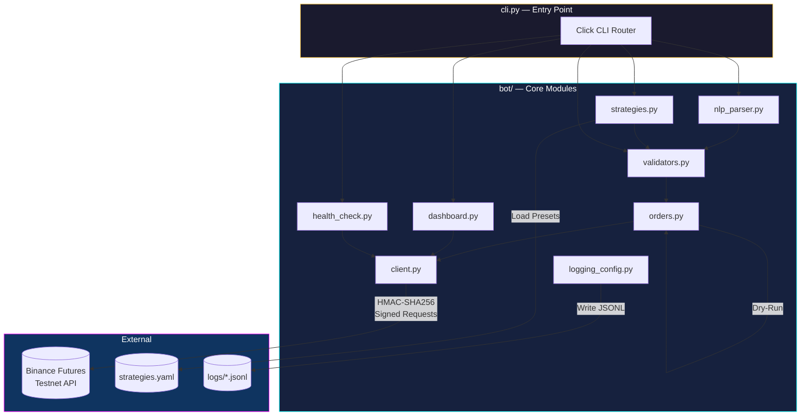

<div align="center">

# ⚡ MANA CORE — Binance Futures Testnet Trading Bot

**A cyberpunk-themed, production-grade CLI trading terminal for Binance Futures Testnet (USDT-M)**

[](https://www.python.org/)
[](https://testnet.binancefuture.com/)
[](https://github.com/Textualize/rich)
[](https://click.palletsprojects.com/)
[](#license)

```
      /\
     /  \      BINANCE FUTURES TESTNET
    / /\ \     TERMINAL v2.0 // NEON-DARK EDITION
   / /__\ \    > SYSTEM_STATUS: ONLINE
  /________\
```

*Live dashboard • NLP order parsing • Dry-run simulation • Strategy presets • Structured JSONL logging*

---

</div>

## 📋 Table of Contents

- [Overview](#overview)
- [Key Features](#-key-features)
- [Architecture](#-architecture)
- [Project Structure](#-project-structure)
- [Getting Started](#-getting-started)
- [Usage](#-usage)
- [Strategy Presets](#-strategy-presets)
- [Environment Variables](#-environment-variables)
- [Safety & Risk Controls](#-safety--risk-controls)
- [Testing](#-testing)
- [Tech Stack](#-tech-stack)
- [Contributing](#-contributing)
- [License](#license)
- [Disclaimer](#-disclaimer)

---

## Overview

**Mana Core** is a feature-rich, terminal-based trading bot designed for the [Binance Futures Testnet](https://testnet.binancefuture.com/). It provides a cyberpunk-styled Rich TUI dashboard for real-time market monitoring, a natural-language order parser that lets you trade in plain English, configurable YAML-based strategy presets, and a comprehensive dry-run mode for risk-free experimentation — all from a single `cli.py` entry point.

> **⚠️ Testnet Only** — This bot is engineered exclusively for the Binance Futures Testnet. It does **not** connect to production Binance APIs. No real funds are ever at risk.

---

## ✨ Key Features

<table>
<tr>
<td width="50%">

### 🖥️ Live TUI Dashboard
Real-time split-pane terminal dashboard powered by [Rich](https://github.com/Textualize/rich). Displays market tickers with sparkline trends, active positions with PnL, open order queue, USDT liquidity, system diagnostics, and a live event log stream — all auto-refreshing.

### 🧠 Natural Language Orders
Trade in plain English. The regex-based NLP parser converts commands like `"buy 0.01 BTC at market"` or `"sell 1 ETH limit at 3200"` into validated, structured API orders — no memorizing flag syntax required.

### 📊 Strategy Presets
Define reusable trading strategies in `strategies.yaml`. List, inspect, and execute named presets with a single command. Supports dry-run for backtesting before live execution.

</td>
<td width="50%">

### 🛡️ Dry-Run Simulation
Every order supports a `--dry-run` flag that returns a realistic simulated response without touching the API. A global `DRY_RUN` environment variable override is also available for full session simulation.

### ✅ Multi-Layer Validation
All inputs pass through strict validation: symbol suffix checks, quantity bounds enforcement (`1e-8` to `1M`), price range validation, LIMIT price requirement, and side/type normalization — before any order reaches the API.

### 📝 Structured JSONL Logging
Every action is recorded to `logs/trading_bot.jsonl` as newline-delimited JSON with timestamps, log levels, logger names, and arbitrary extra fields — creating a complete, machine-parseable audit trail.

</td>
</tr>
</table>

---

## 🏗 Architecture



### Data Flow

```
User Input ──► CLI Router ──► Validator ──► Order Builder ──► Binance API
                  │                              │
                  │                              ├──► Dry-Run Simulator
                  │                              │
                  ├──► NLP Parser ───────────────┘
                  ├──► Strategy Loader ──────────┘
                  ├──► Dashboard Engine ──► Live TUI
                  └──► Health Check ──► Status Report
```

---

## 🗂 Project Structure

```
trading_bot/
│
├── cli.py                  # Main CLI entry point (Click groups & commands)
├── strategies.yaml         # Named strategy preset definitions (YAML)
├── requirements.txt        # Pinned Python dependencies
├── .env                    # API credentials (git-ignored)
├── .gitignore              # Git exclusions
│
├── bot/                    # Core trading engine package
│   ├── __init__.py
│   ├── client.py           # Authenticated Binance REST API wrapper (HMAC-SHA256)
│   ├── orders.py           # Order building, dry-run simulation & placement
│   ├── validators.py       # Strict multi-layer input validation
│   ├── nlp_parser.py       # Natural language → structured order parser
│   ├── dashboard.py        # Live Rich TUI dashboard engine (split-pane layout)
│   ├── strategies.py       # YAML strategy preset loader & executor
│   ├── health_check.py     # Startup env/API health validator
│   ├── logging_config.py   # JSONL structured logging system
│   └── tests/
│       ├── __init__.py
│       └── tests.py        # Pytest suite (validation, NLP, dry-run, CLI)
│
└── logs/
    └── trading_bot.jsonl   # Structured log output (auto-created)
```

---

## 🚀 Getting Started

### Prerequisites

- **Python 3.10+**
- A [Binance Futures Testnet](https://testnet.binancefuture.com/) account with API keys

### 1 — Clone the Repository

```bash
git clone https://github.com/githarshking/traiding_bot.git
cd traiding_bot
```

### 2 — Install Dependencies

```bash
pip install -r requirements.txt
```

<details>
<summary>📦 <strong>Dependencies</strong></summary>

| Package | Version | Purpose |
|:--------|:--------|:--------|
| `python-binance` | 1.0.19 | Binance SDK (reference) |
| `requests` | 2.31.0 | HTTP client for API calls |
| `rich` | 13.7.1 | Terminal UI / dashboard rendering |
| `click` | 8.1.7 | CLI framework & argument parsing |
| `python-dotenv` | 1.0.1 | `.env` file loading |
| `pyyaml` | 6.0.1 | Strategy YAML parsing |
| `python-dateutil` | 2.9.0 | Date/time utilities |
| `pytest` | 9.0.3 | Test framework |

</details>

### 3 — Configure Environment

```bash
# Create your .env file
cp .env.example .env
```

Edit `.env` with your Testnet credentials:

```env
BINANCE_API_KEY=your_testnet_api_key_here
BINANCE_API_SECRET=your_testnet_api_secret_here
```

> **💡 Tip:** Get your Testnet API keys at [testnet.binancefuture.com](https://testnet.binancefuture.com/) → Log in → API Management → Generate Key

### 4 — Verify Installation

```bash
python cli.py health
```

A successful health check displays:

```
┌─────────────────────────────────────┐
│       System Health Check           │
├─────────┬──────────┬────────────────┤
│ Check   │ Status   │ Detail         │
├─────────┼──────────┼────────────────┤
│ Env Vars│  ✓ OK    │ API key loaded │
│ API Ping│  ✓ OK    │ Testnet reach… │
│ Account │  ✓ OK    │ USDT balance:… │
└─────────┴──────────┴────────────────┘
```

---

## 🎮 Usage

### Place Orders

```bash
# Market order
python cli.py order --symbol BTCUSDT --side BUY --type MARKET --qty 0.01

# Limit order
python cli.py order --symbol ETHUSDT --side SELL --type LIMIT --qty 1.0 --price 3200

# Dry-run (simulated — no API call)
python cli.py order --symbol BTCUSDT --side BUY --type MARKET --qty 0.01 --dry-run

# Skip confirmation prompt
python cli.py order --symbol SOLUSDT --side BUY --type MARKET --qty 10 --dry-run --yes
```

### Natural Language Orders

```bash
python cli.py nlp "buy 0.01 BTC at market"
python cli.py nlp "sell 1 ETH limit at 3200"
python cli.py nlp "long 0.5 BNB"
python cli.py nlp "short 0.05 ETH" --dry-run
```

<details>
<summary>🧠 <strong>Supported NLP Syntax</strong></summary>

| Token | Recognized Aliases |
|:------|:-------------------|
| **Side** | `buy`, `long`, `b` → BUY · `sell`, `short`, `s` → SELL |
| **Type** | `market`, `mkt`, `m` → MARKET · `limit`, `lmt`, `l` → LIMIT |
| **Price** | `at 3200`, `@ 3200`, `price 3200`, `px 3200` |
| **Symbol** | `BTCUSDT`, `BTC`, `ETH`, `BNB`, `SOL`, `XRP`, `ADA`, `DOGE`, `AVAX`, `DOT`, `MATIC` |

</details>

### Live Dashboard

```bash
python cli.py dashboard                 # Default 5s refresh
python cli.py dashboard --refresh 10    # Custom refresh interval
```

The dashboard renders a multi-pane layout:

```
┌──────────┬─────────────────────────────────────┐
│  SYSTEM  │  > DATALINK         │  > QUEUE      │
│   Logo   │  SYM  TREND  MARK  │  ID SYM SIDE  │
│          │  BTC  ▂▃▅▆  67,245 │  ...          │
│  DIAG    │  ETH  █▇▆▅   3,412 │               │
│  Ping    │  ...               │               │
│  Memory  ├─────────────────────────────────────┤
│          │  > ACTIVE POSITIONS                 │
│  USDT    │  SYM  AMT   ENTRY   PNL            │
│  Balance ├─────────────────────────────────────┤
│          │  > SYSTEM EVENT STREAM              │
│          │  12:30:05  INFO  Order placed...    │
└──────────┴─────────────────────────────────────┘
```

### View Logs

```bash
python cli.py logs               # Last 50 entries
python cli.py logs --n 20        # Last 20 entries
python cli.py logs --level ERROR # Filter by severity
```

---

## 📈 Strategy Presets

Define reusable strategies in `strategies.yaml`:

```yaml
strategies:
  scalp_btc:
    name: "BTC Scalp Long"
    symbol: BTCUSDT
    side: BUY
    type: MARKET
    quantity: 0.001
    description: "Quick long scalp on BTC — small size, market entry"

  swing_eth_long:
    name: "ETH Swing Long"
    symbol: ETHUSDT
    side: BUY
    type: LIMIT
    quantity: 0.1
    price: 3000.0
    description: "Limit-based swing long on ETH near support"
```

### Strategy Commands

```bash
# List all available strategies
python cli.py strategies list

# Execute a strategy
python cli.py strategies run scalp_btc

# Dry-run a strategy
python cli.py strategies run swing_eth_long --dry-run

# Execute without confirmation prompt
python cli.py strategies run scalp_btc --yes
```

### Built-in Presets

| Key | Name | Pair | Side | Type | Qty | Description |
|:----|:-----|:-----|:-----|:-----|:----|:------------|
| `scalp_btc` | BTC Scalp Long | BTCUSDT | BUY | MARKET | 0.001 | Quick market long scalp |
| `swing_eth_long` | ETH Swing Long | ETHUSDT | BUY | LIMIT @3000 | 0.1 | Limit swing near support |
| `eth_short` | ETH Short | ETHUSDT | SELL | MARKET | 0.05 | Momentum fade short |
| `bnb_dca` | BNB DCA Buy | BNBUSDT | BUY | LIMIT @550 | 0.5 | DCA limit buy on dip |

---

## 🔐 Environment Variables

| Variable | Required | Default | Description |
|:---------|:--------:|:--------|:------------|
| `BINANCE_API_KEY` | ✅ | — | Testnet API key |
| `BINANCE_API_SECRET` | ✅ | — | Testnet API secret |
| `BINANCE_BASE_URL` | ❌ | `https://testnet.binancefuture.com` | API base URL |
| `DRY_RUN` | ❌ | `false` | Global dry-run override (`true` / `false`) |
| `LOG_FILE` | ❌ | `logs/trading_bot.jsonl` | JSONL log output path |
| `LOG_LEVEL` | ❌ | `INFO` | Logging verbosity (`DEBUG`, `INFO`, `WARNING`, `ERROR`) |

---

## 🛡 Safety & Risk Controls

| Layer | Feature | Description |
|:------|:--------|:------------|
| **🔒 Input** | Symbol Validation | Enforces `USDT` suffix, 5–12 character bounds |
| **🔒 Input** | Quantity Bounds | Range: `1e-8` to `1,000,000` |
| **🔒 Input** | Price Validation | Required for LIMIT orders, range: `1e-8` to `10,000,000` |
| **🔒 Input** | Side/Type Normalization | Case-insensitive, whitespace-trimmed |
| **⚙️ Execution** | Confirmation Prompt | Rich panel summary + explicit `y/N` confirmation |
| **⚙️ Execution** | Dry-Run Mode | `--dry-run` flag or `DRY_RUN=true` env var |
| **⚙️ Execution** | HMAC-SHA256 Signing | All authenticated requests are signed with timestamp + recvWindow |
| **📊 Observability** | Structured Logging | Full JSONL audit trail with extra context fields |
| **📊 Observability** | Health Checks | Pre-flight env var + API connectivity validation |
| **🌐 Network** | Testnet Isolation | Hardcoded to Testnet URL — production keys will not work |

---

## 🧪 Testing

The project includes a Pytest suite covering validation, NLP parsing, dry-run execution, and CLI integration:

```bash
# Run full test suite
pytest bot/tests/tests.py -v

# Run with output
pytest bot/tests/tests.py -v -s
```

### Test Coverage

| Category | Tests | Description |
|:---------|:------|:------------|
| **Validation** | 4 | Market/Limit orders, missing price, invalid quantity |
| **NLP Parser** | 1 | English → structured order translation |
| **Order Execution** | 1 | Dry-run simulation without API calls |
| **CLI Integration** | 1 | End-to-end Click runner with `--dry-run --yes` |

---

## 🔧 Tech Stack

<div align="center">

| Layer | Technology | Role |
|:------|:-----------|:-----|
| **Language** | Python 3.10+ | Core runtime |
| **CLI Framework** | Click 8.x | Command routing & argument parsing |
| **Terminal UI** | Rich 13.x | Dashboard, panels, tables, live rendering |
| **HTTP Client** | Requests 2.x | REST API communication |
| **Configuration** | python-dotenv + PyYAML | Env vars & strategy presets |
| **Authentication** | HMAC-SHA256 | Request signing (custom implementation) |
| **Logging** | Custom JSONL Handler | Structured audit logging |
| **Testing** | Pytest 9.x | Unit & integration tests |

</div>

---

## 🤝 Contributing

Contributions are welcome! Here's how to get started:

1. **Fork** the repository
2. **Create** a feature branch (`git checkout -b feature/amazing-feature`)
3. **Commit** your changes (`git commit -m 'feat: add amazing feature'`)
4. **Push** to the branch (`git push origin feature/amazing-feature`)
5. **Open** a Pull Request

Please ensure all tests pass before submitting:

```bash
pytest bot/tests/tests.py -v
```

---

## License

This project is licensed under the **MIT License**. See [LICENSE](LICENSE) for details.

---

## ⚠️ Disclaimer

> **This bot connects exclusively to the Binance Futures Testnet.** No real funds are involved. Never use production API keys with this software. All trading — even on testnet — involves simulated risk. This project is provided for **educational and demonstration purposes only**. The authors assume no liability for any losses or damages arising from the use of this software.

---

<div align="center">

**Built with ⚡ by [Harsh](https://github.com/githarshking)**

*Mana Core v2.0 — Neon-Dark Edition*

</div>
